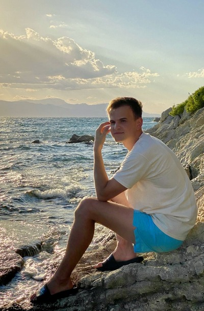

#### Front-End Developer

# Volodymyr Sozonik



### Contact info:

- Phone: +38 (096) 049 40 59
- E-mail: thatsmyname98x@gmail.com
- Telegram: [@ovv978](https://t.me/ovv978)

---

### About me:

Greetings! I’m a 26-year-old front-end development enthusiast from Ukraine. I'm currently diving deeper into web development and really enjoying it. With a strong foundation in JavaScript, HTML, and CSS, I’m excited to create stunning and interactive websites.

---

### Proficiency and Skills:

- JavaScript Basics;
- HTML5, CSS3;
- Node.js;
- Git, GitHub;
- VS Code;
- Figma, Pixso, Skecth.

---

### Code example:

**The accum function takes a string and returns it in the following format:**

```
function accum(s) {
  return s
    .split('')
    .map((char, i) => char.toUpperCase() + char.toLowerCase().repeat(i))
    .join('-');
}
```

---
