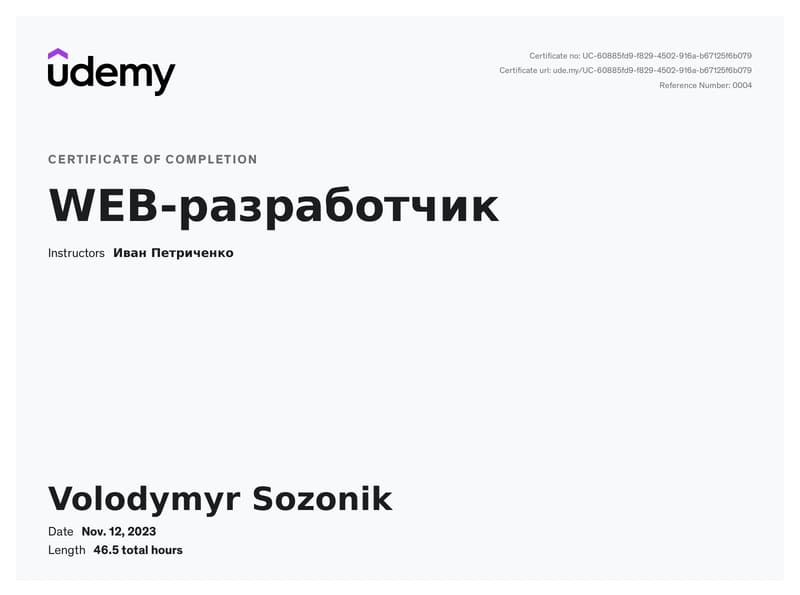
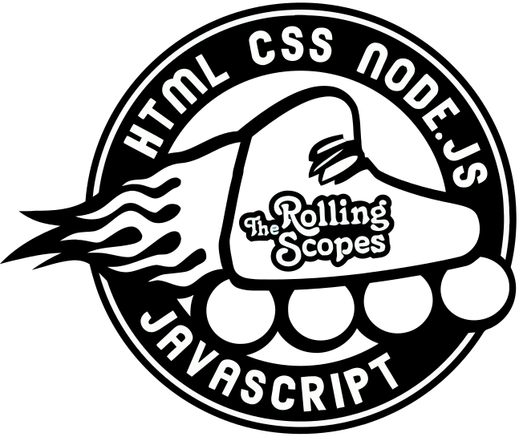

#### Front-End Developer

# Volodymyr Sozonik


### Contact info:

- Phone: +38 (096) 049 40 59
- E-mail: thatsmyname98x@gmail.com
- Telegram: [@ovv978](https://t.me/ovv978)

---

### About me:

Greetings! I’m a 26-year-old front-end development enthusiast from Ukraine. I'm currently diving deeper into web development and really enjoying it. With a strong foundation in JavaScript, HTML, and CSS, I’m excited to create stunning and interactive websites.

---

### Proficiency and Skills:

- JavaScript;
- HTML5, CSS3;
- SASS, FlexBox, Grid;
- Node.js;
- Git, GitHub;
- VS Code;
- Figma, Pixso, Skecth.

---

### Code example:

**The accum function takes a string and returns it in the following format:**

```
function accum(s) {
  return s
    .split('')
    .map((char, i) => char.toUpperCase() + char.toLowerCase().repeat(i))
    .join('-');
}
```

---

### Education:

- Lviv Polytechnic National University, Civil Building and Environmental Engineering. Master's degree.

  September 2016 - January 2021 | Lviv, Ukraine

---

### Work experience:

- Design engineer at the consulting company **"Trio-consult"** (5 years, remote-work).

### Courses:

- **"WEB-разработчик"** on [Udemy](https://www.udemy.com/share/101Wy23@N0_2LUUIQsHu-vefXfMh61zzeOev0ufrXEBkVkjyhkGxTU9pCHW2SIPxMNgTUDDO0g==/) (completed).



- **"Полный курс по JavaScript + React - с нуля до результата"** on [Udemy](https://www.udemy.com/share/101WCC3@oS0CbdT9UUGcfqMXPr6ZRL_tOIpD-y-W4SD__Sn2-HV7NaBiO2US7OuAZLqhfS7BnQ==/) (in process).

---

### Languages:

- Ukrainian (Native, fluent);
- Russian (Fluent, proficient in daily use);
- English (Pre-intermediate, conversational, used in a work environment);

---

### Soft Skills:

- Teamwork;
- Communication;
- Problem-Solving;
- Attention to Detail;
- Continuous Learning;
- Adaptability.

---

### Conclusion:

I am passionate about web-development and committed to improving my skills in this area. My background in engineering has given me a strong foundation in technology, adaptability, and communication. I am excited to bring my skills and dedication to a dynamic organization in the web development field.

\
\
\
\

