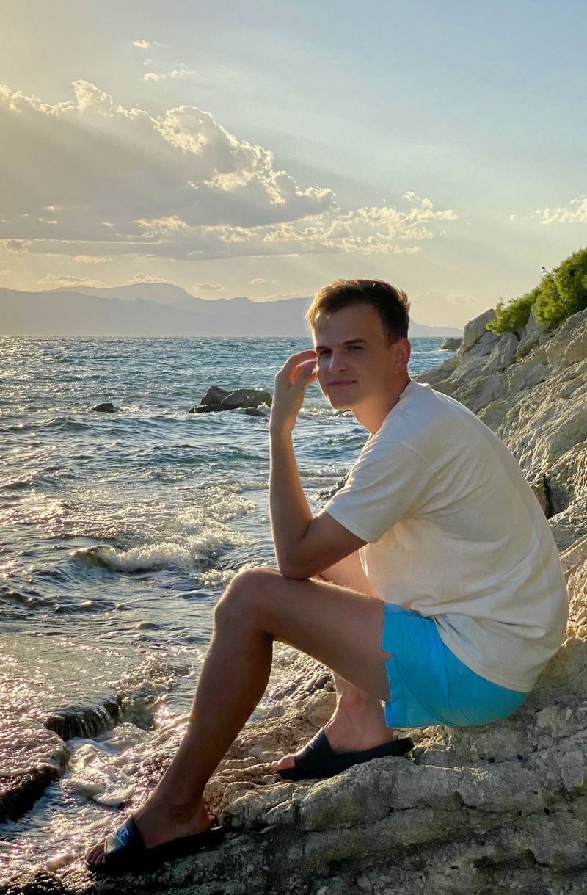

#### Front-End Developer

# Volodymyr Sozonik



### Contact info:

 * Phone:    +38 (096) 049 40 59              
 * E-mail:   thatsmyname98x@gmail.com         
 * Telegram: [@ovv978](https://t.me/ovv978)

---

### About me:

Greetings! I’m a 26-year-old front-end development enthusiast from Ukraine. I'm currently diving deeper into web development and really enjoying it. With a strong foundation in JavaScript, HTML, and CSS, I’m excited to create stunning and interactive websites.

---

### Proficiency and Skills: 
* JavaScript Basics;
* HTML5, CSS3;
* Node.js;
* Git, GitHub;
* VS Code;
* Figma, Pixso, Skecth.

---

### Code example:
This code is taken from ***Codewars.*** *Function **likes** returns text depending on the number of names in the **names** array:*

```
function likes(names) {
if (names.length === 0) {
        return "no one likes this";
    } else if (names.length === 1) {
        return `${names[0]} likes this`;
    } else if (names.length === 2) {
        return `${names[0]} and ${names[1]} like this`;
    } else if (names.length === 3) {
        return `${names[0]}, ${names[1]} and ${names[2]} like this`;
    } else {
        return `${names[0]}, ${names[1]} and ${names.length - 2} others like this`;
    }
}
```
---

### Education:
- Lviv Polytechnic National University, Civil Building and Environmental Engineering. Master's degree.

  September 2016 - January 2021 | Lviv, Ukraine 

---

### Work experience:
- Design engineer at the consulting company **"Trio-consult"** (4,5 years, remote-work).

---
### Courses: 

*  **"WEB-разработчик"** on [Udemy](https://www.udemy.com/share/101Wy23@N0_2LUUIQsHu-vefXfMh61zzeOev0ufrXEBkVkjyhkGxTU9pCHW2SIPxMNgTUDDO0g==/) (completed).
  


* **"Полный курс по JavaScript + React - с нуля до результата"**  on [Udemy](https://www.udemy.com/share/101WCC3@oS0CbdT9UUGcfqMXPr6ZRL_tOIpD-y-W4SD__Sn2-HV7NaBiO2US7OuAZLqhfS7BnQ==/) (in process).

---

### Languages:

- Ukrainian (Native, fluent);
- Russian (Fluent, proficient in daily use);
- English (Pre-intermediate, conversational, used in a work environment);

---
### Soft Skills:
- Teamwork;
- Communication;
- Problem-Solving;
- Attention to Detail;
- Continuous Learning;
- Adaptability.

---
### Conclusion:
I am passionate about web-development and committed to improving my skills in this area. My background in engineering has given me a strong foundation in technology, adaptability, and communication. I am excited to bring my skills and dedication to a dynamic organization in the web development field.


\
\
\
\
